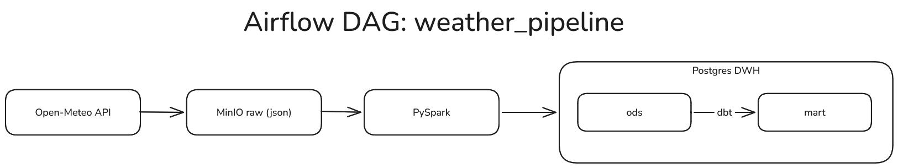

# weather_pipeline
ELT-пайплайн. Собирает исторические данные о погоде с помощью open-meteo api, далее с минимальными правками загружает 
в хранилище minio в формате json (**raw слой**). Из хранилища данные выгружаются с помощью spark'а, делятся на два
датафрейма, обрабатываются и добавляются в таблицы базы данных Postgres (**слой ods**). После чего с помощью dbt создается 
витрина данных (**слой mart**), основная задача которой агрегировать показатели температуры и количества осадков
и выводить индекс комфорта - показатель, на который можно ориентироваться при планировании поездки.

## Архитектура


## Стек
- Airflow 3.3.0 — оркестрация
- MinIO — хранилище raw слоя
- PySpark 3.5.0 — трансформация и загрузка в postgres
- PostgreSQL — DWH (ods + mart)
- dbt (dbt-postgres) — создание модели и проведение тестов
- Docker Compose — поднятие контейнеров с инструментами для работы на локальном компьютере

## Ключевые функции
- Инкрементальность и идемпотентность:
  - raw: дата последней выгрузки хранится в MinIO (meta-open-meteo/{city}/last_loaded)
    и обновляется только после успешной выгрузки;
  - ods: при загрузке берётся максимальная дата по каждому городу и список уже
    записанных городов, грузится только новое
  - повторный прогон дага не создаёт дублей на всех слоях
- Партицированное хранение данных в raw слое (city, dt)
- Тесты данных таблицы в mart слое (not null, accepted_values)

## Запуск
1. Создать `.env` файл в папке проекта и внести: POSTGRES_USER, POSTGRES_PASSWORD, POSTGRES_DB,
MINIO_ROOT_USER, MINIO_ROOT_PASSWORD
2. `docker compose up -d --build`
3. В веб-интерфейсе airflow:
   - Connection ID:`weather_db`, Connection Type:`Postgres`, Host:`postgres`, Login:`логин postgres`,
Password:`пароль postgres`, Port:`5432`, Database:`значение POSTGRES_DB из .env`
   - Variables: `MINIO_ACCESS_KEY`, `MINIO_SECRET_KEY` (значения — MINIO_ROOT_USER / MINIO_ROOT_PASSWORD из `.env`)
4. Запустить DAG `weather_hist`
5. Выгрузить данные:
```sql
select *
from mart.city_months_stats
where mnth = 'August'
order by comf_index desc;
```
Результат:

|mnth|city|avg_precipitation_sum|avg_temperature_2m_max|avg_temperature_2m_min|comf_index|
|----|----|---------------------|----------------------|----------------------|----------|
|August|Madrid|0.27|34.33|20.56|32.98|
|August|Salamanca|0.1|31.31|15.97|30.81|
|August|Valencia|0.46|31.28|23.06|28.98|

## Модель данных
- `ods.weather` — ежедневные данные: city, dt, temperature_2m_max/min, precipitation_sum
- `ods.cities` — city, latitude, longitude
- `mart.city_months_stats` — mnth, city, avg_precipitation_sum, avg_temperature_2m_max,
avg_temperature_2m_min, comf_index(`= avg(temperature_2m_max) - 5 * avg(precipitation_sum)`)